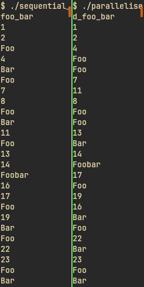
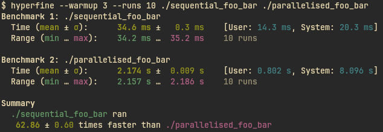

# Multi-thread practice

Reiterating basic multi-threadedness in Rust.

## Comparison

You can see the parallelised one actually does run async!
Here, you can see the sequential version print the numbers in order, while the paralleled one does not necessarily do this:

| $ ./sequential_foo_bar | $ ./parallelised_foo_bar |
|------------------------|--------------------------|
| 1                      | 1                        |
| 2                      | 2                        |
| Foo                    | 4                        |
| 4                      | Foo                      |
| Bar                    | Foo                      |
| Foo                    | 7                        |
| 7                      | 11                       |
| 8                      | 8                        |
| Foo                    | Foo                      |
| Bar                    | Foo                      |
| 11                     | 13                       |
| Foo                    | Bar                      |
| 13                     | 14                       |
| 14                     | Foobar                   |
| Foobar                 | 17                       |
| 16                     | Foo                      |
| 17                     | 19                       |
| Foo                    | 16                       |
| 19                     | Bar                      |
| Bar                    | Foo                      |
| Foo                    | 22                       |
| 22                     | Bar                      |
| 23                     | 23                       |
| Foo                    | Foo                      |
| Bar                    | Bar                      |



Notice how the parallelised version shows `4` one position too early, as well as `11` many positions too early and `16` a few places late.

> ⚠️ Caution ⚠️  
> The *(ugly)* parallelised version is much slower than the sequential one!

```
$ hyperfine --warmup 3 --runs 10 ./sequential_foo_bar ./parallelised_foo_bar
Benchmark 1: ./sequential_foo_bar
  Time (mean ± σ):      34.6 ms ±   0.3 ms    [User: 14.3 ms, System: 20.3 ms]
  Range (min … max):    34.2 ms …  35.2 ms    10 runs
 
Benchmark 2: ./parallelised_foo_bar
  Time (mean ± σ):      2.174 s ±  0.009 s    [User: 0.802 s, System: 8.096 s]
  Range (min … max):    2.157 s …  2.186 s    10 runs
 
Summary
  ./sequential_foo_bar ran
   62.86 ± 0.60 times faster than ./parallelised_foo_bar
```


